## Day 8

### Towel on the Sunbed

#### Points: 90
#### Category: Web
#### Difficulty: Medium

#### Briefing
Ponzi found the resort's wellness portal running a little side project called *Ponzi* -- a crypto rewards app, Poolside edition. He set his towel down, claimed his daily reward, and went to reapply sunscreen. He came back to find the sunbed had been "claimed" three times over while he wasn't looking. 

He's convinced the app owes him a spot in the Whale Vault. The app disagrees, politely, once every 24 hours. Somewhere between his request and the server's clock there's a gap wide enough to walk a whale through.

#### Itinerary
- [ ] Create a guest account and explore Ponzi's daily reward mechanism
- [ ] Work out exactly what's standing between you and Whale Vault status
- [ ] Find your way past it and retrieve the flag from the vault

#### @0xMia's Story

"ponzi guy has been refreshing his dashboard for an HOUR waiting on this timer 💀 bro really thinks the clock is the only thing checking him #HackerHolidays"

#### Preliminary thoughts:
I think we are going to use a proxy to see what the communication is like between the server and the client. sounds like something fishy is going on during the communication but I am not quite sure. it describes it as a medium difficulty, and oh what do you know at the bottom it includes 4 tags

#web_Exploitation #Business_logic #Burp_Suite #api_abuse

First things first, I created an account and looked at how to claim a reward. I was able to claim a reward and it says I have done my daily claim and I have 50 out of 150 points to get into the vault. I am creating a second account to try to start capturing the transaction between the client and server. The fact it is talking about "timing" and a gap big enough to drive a whale through. I think there is some race condition exploit we are going to be able to make.


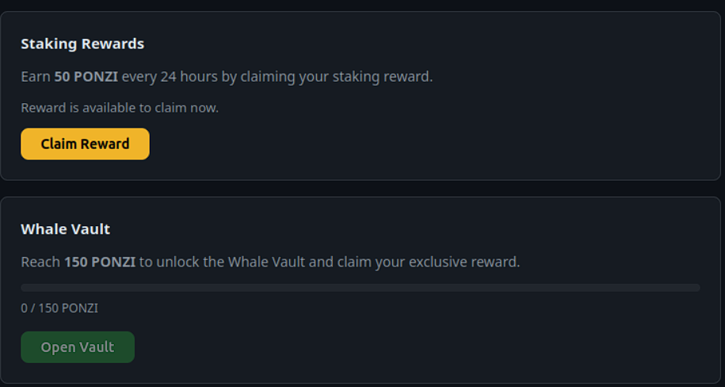
Before I continue I am launching Burp Suite and will be using the proxy server to intercept traffic between myself and the server to see how I may be able to manipulate the requests to the server.


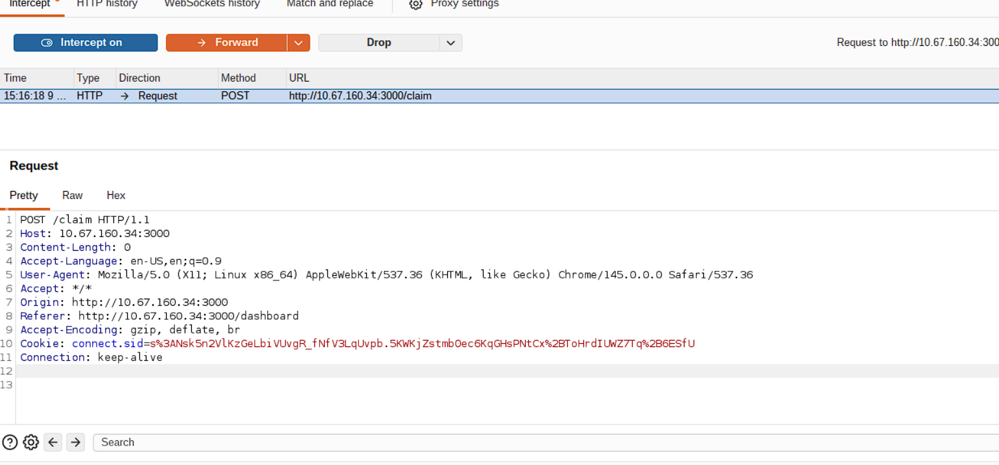

So now that I have submitted a claim and intercepted the post command we have a little detail about what is going on. Now I am going to right click this http post command and send it to teh repeater
```
 - *Repeater*: Another well-known feature. Repeater allows for capturing, modifying ,and resending the same request multiple time. This functionality is useful when crafting payloads through trial and error(Like SQLi) or testing the functionality of an endpoint for vulnerabilities.
```

this is my definition of Repeater from a previous lesson. So you can see that I might be able to exploit a race condition but rapidly resending the same request multiple times. This may allow me to claim more than my fair share of rewards but getting the reward claim in before my reward claim counter has had a chance to tally my request.
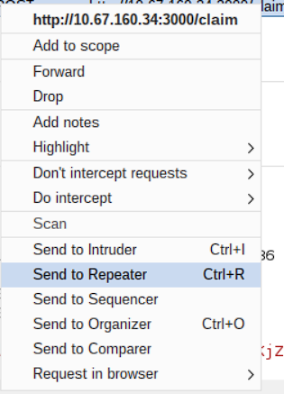
now that I have the Post Claim command saved in my repeater I am going to drop the Claim I intercepted to ensure I do not accidentally send the claim before I am ready to exploit.
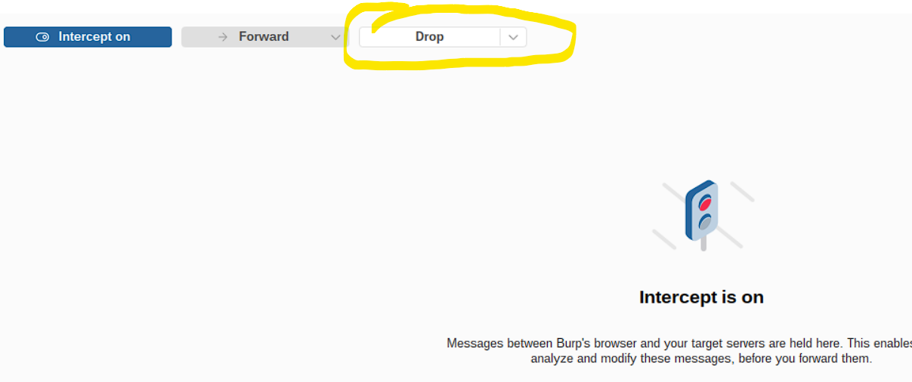

Back on my repeated tab I am going to create a new tab group and call it Reward Claim.


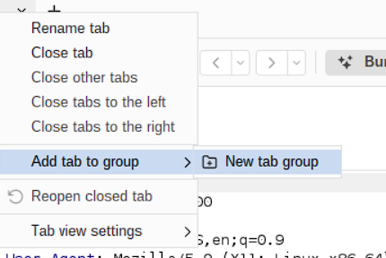

We then to select how many times we are going to do this. 
1. Right click the number next to the tab and select duplicate 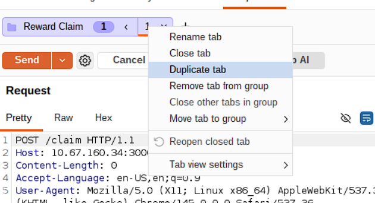
2. make sure we select to do it enough time to get the minimum points required to earn the reward
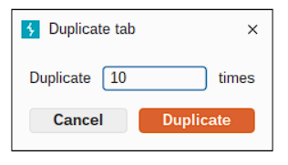
3. now we are going to have to send this group of tabs in parallel.  right click teh drop down next to send and select send group in parallel 
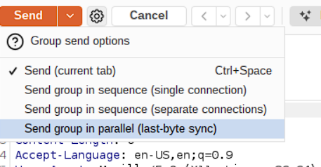

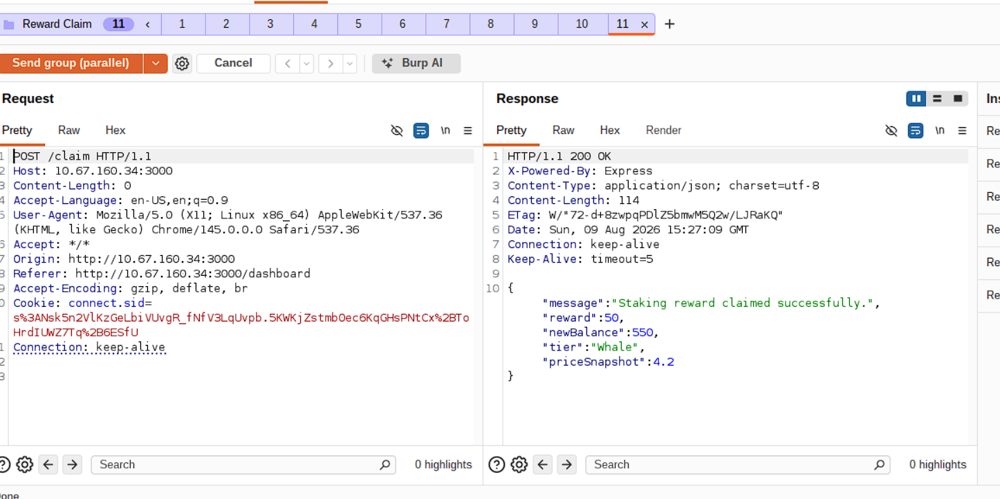

Now as you can see I sent this request 11 times (I didn't think about the fact I was duplicating 1 request so I already had 1 and made 10 duplicates of it) receiving a ton of responses and every response shows my balance climbing higher.

But now we shall see if I am able to claim the whale vault prize.

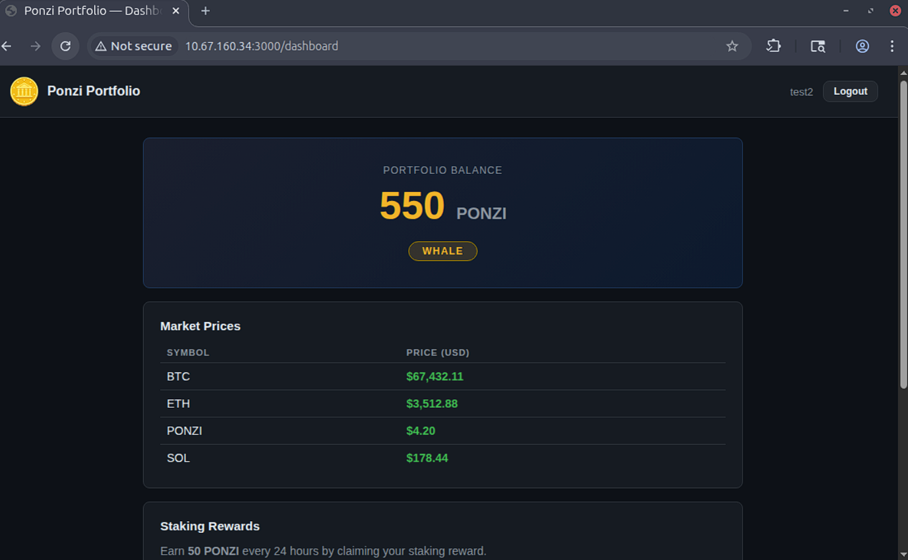

and yes here we go

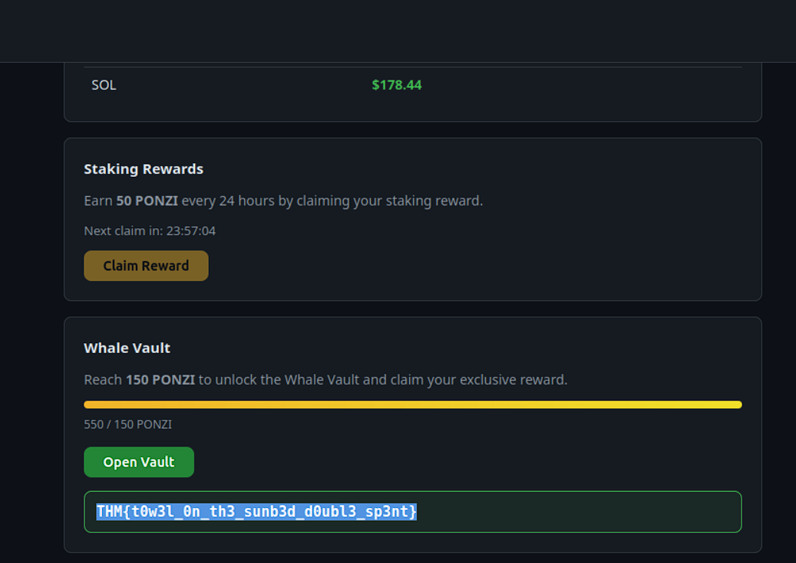

I got the flag


### closing thoughts
I know the exploit is a Race Condition which is when two opposing events race each other. In this case it was a request for points, and the eligibility status updating. So, to prevent this kind of exploit developers would need to apply a system that verifies eligibility, records the usage, removes eligibility, and provides the reward either all at once or in the proper order to ensure the user cannot exploit the system. This was the first time I had a lab to use the repeater in, and it was a learning experience to see you can group the requests in different ways, and I cannot imagine how important it is to drop that intercepted HTTP POST. would be a pain the butt to have to redo everything. 
