## Day 10
### The Hollow Shell
#### Points: 90
#### Category: Web
#### Difficulty: Medium

#### Briefing
You find it on the beach: pretty, ordinary, the kind of thing nobody thinks to check. Slip something inside and hold it to your ear.

The Byte Lotus beachfront lets guests personalise their in-room display by uploading a shell — a little souvenir pack of shoreline ambiance. Staff publish them through the Shoreline Display portal, and once a shell is "held to the room's ear" it plays its shore. Slip past what the portal forgets to check, and the shell answers with a shell of your own.

#### Itinerary
- [ ] Find the Flag

#web 

#### Room Access: 
target machine ;
`http://10.64.182.126
`
#### Preliminary thoughts

I am wondering if there is going to wind up being more than meets to the eyes to this room. I am going to start by nmapping the target machine and see what is open. from the description and my experience I thought I was going to use some kind of reverse shell exploit but we will see where that path leads.
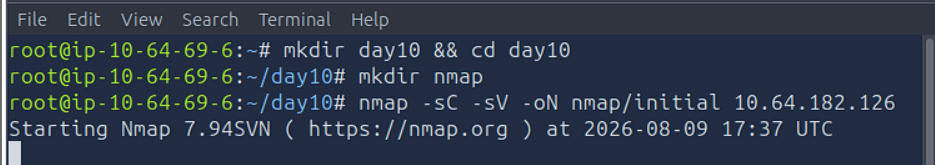

so far it looks like normal stuff I ssh on port 22 and what appears to be http on port 5000

so I visited `http://10.64.182.126:5000` was redirected to a `/login`

not a whole lot going on here. Let's check out the page source and see what happens...

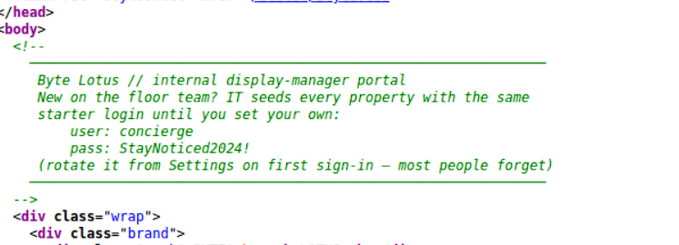

that seems unwise to have in the html...

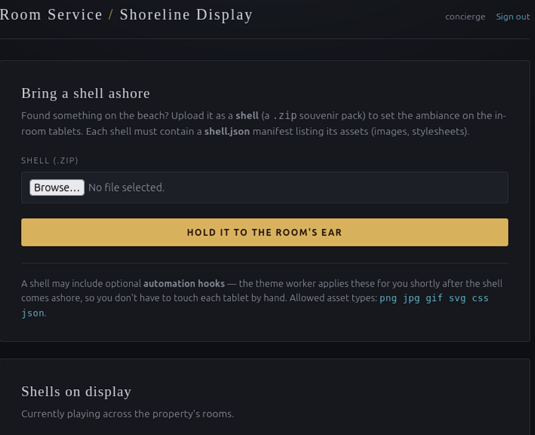

Yeah I'll say most people forget to rotate the credentials it had bloody 2024 in it, they probably have been wide open since sometime in 2024. well now I got a common reverse shell situation here. Need to make a reverse shell inside a file to probably get them to call me

Going to start a netcat listening on port 4444 now because I just know after I Get a payload built that is what I am going to need.

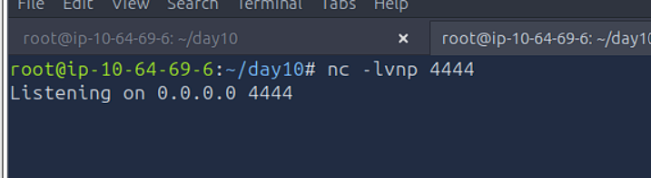

now referring to the previous image we see the zip file should have a photo or something in it as well. so we can take this opportunity to learn how to MAKE an image file in the command line of Linux.  we basically just need to put the magic numbers into an associated file type.

I ran `printf "GIF89a" > grenadine.gif` to make a blank .gif file. and then I associated the gif with a shell.json because the website said it needs a .zip file with a shell.json that contained a list of  assets

`echo '{"asset":"grenadine.gif"} > shell.json`

then I zipped that together 

`zip shell.zip shell.json grenadine.gif` 

because a .zip is the only kind of file it will let me upload. then I tried to upload it but hit a problem
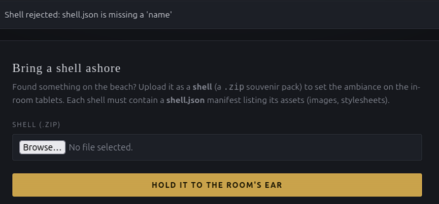

it needs a name

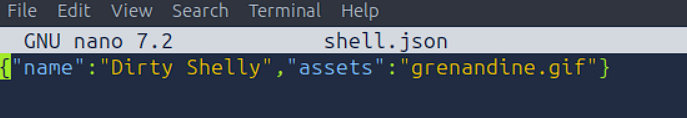

tried again and got a new error.

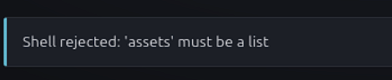

so nwo I have to put the assets into a  list in order to upload it.
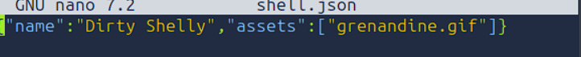
and now I was able to successfully upload it

alright we got it figured out how to upload a file to this website now lets see if it will let us go there. so I took that path it shows there and added the name of my gif to it and went to the URL 

`http://10.64.182.126:5000/shells/5cf18c3ad535/grenadine.gif`
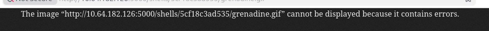

and we got somewhere we were able to actually GET that page. so we could definitely try to get REC. 

so I tried to run a python script to see if I could do it. 

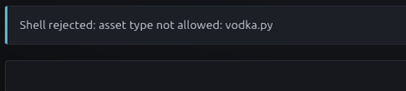

But I noticed it rejected it because the asset type is not allowed, so I just did not list the python among the list of assets. and it accepted it.
I forgot to screen shot it accepting it but here are two dirty shelly zips I was able to upload.

then I tried to execute the python script
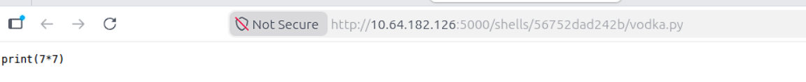
I was able to get to it, but it did not execute. we have to find some way to get to a portion that can run the script.

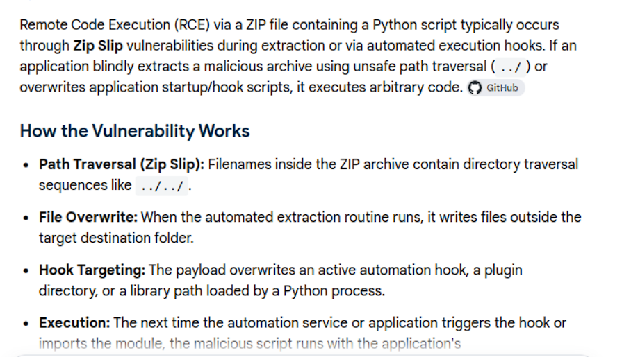
We can use a common RCE tactic known as a zip slip to try to commit directory traversal and get to the automation hooks section to execute some script.

WE are going to have to someone navigate the python script to ../../hooks/vodka.py to get their system drunk.

and we know it is 2 directories up because we had to go to shells/56752dad242b/ to get to our python script and .gif earlier.

so to write the reverse shell script I tried a website that automatically write ones for me and I pasted it into a payload variable in vodka.py
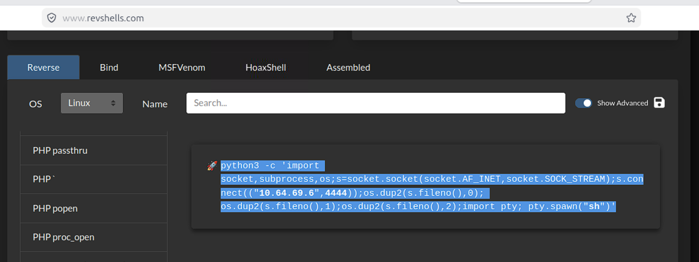

now we have a created a new zip file called 7-Up.zip that I will try to upload.

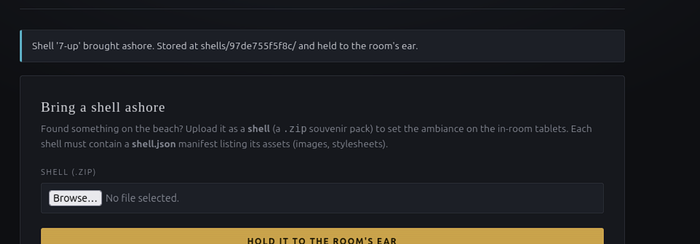

and it executed

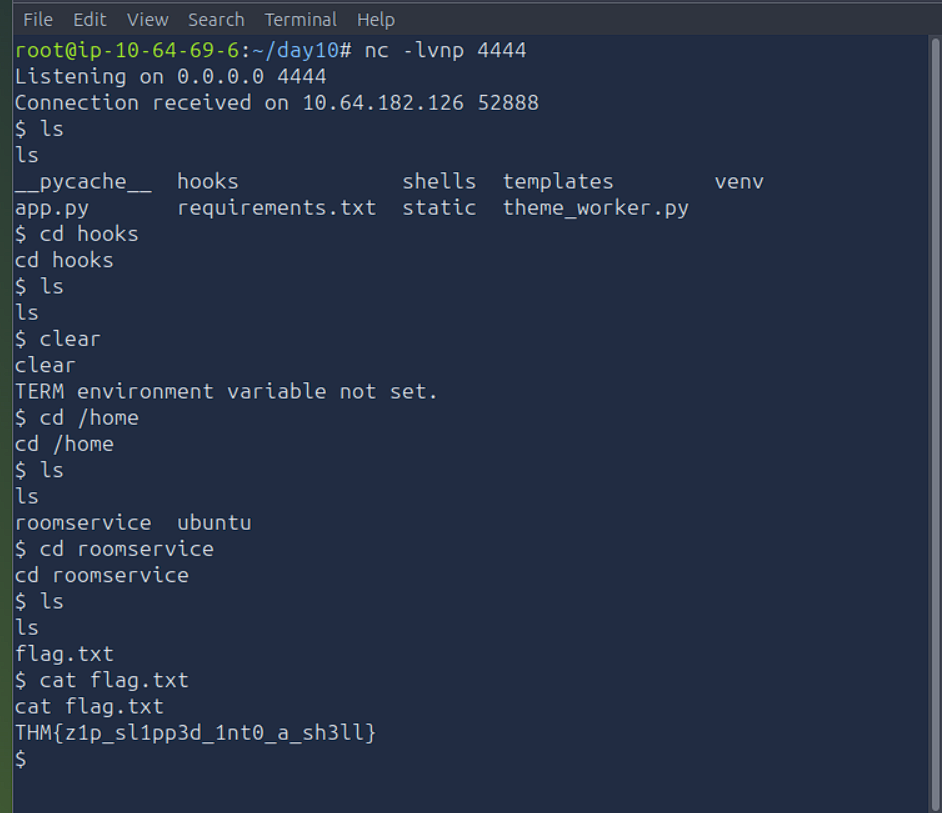

and that is why I was able to dig around and find the flag.txt with the flag.

#### Closing Thoughts

So again the tried and true go to the website and inspect the html trick revealed our first glimpse into how to penetrate this website.

Make sure to always force an update of credentials when logging in with default credentials. And furthermore sanitize file names, use safe extraction logic, and avoid auto-executing uploads without strict sandboxing and code review.

I am also thankful for finding revshells.com because I have had a hard time figuring out what I need to do to write a reverse shell.